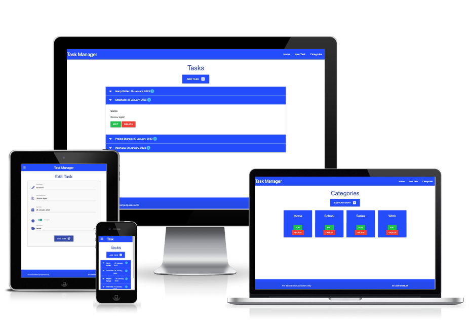
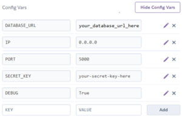

# Relational Databases Task Manager

A Relational Database Task Manager site created as a walkthrough project from Code Institute.

Users are able to create, view, edit and delete their tasks and categories.

Visit the live site here: [Relational Databases Task Manager](https://flask-sqlalchemy-manager-task.herokuapp.com/)

## CONTENTS

* [User Experience](#User-Experience)
  * [User Stories](#User-Stories)

* [Design](#Design)
  * [Colour Scheme](#Colour-Scheme)
  * [Typography](#Typography)
  * [Imagery](#Imagery)
  * [Wireframes](#Wireframes)
  * [Features](#Features)
  * [Accessibility](#Accessibility)

* [Technologies Used](#Technologies-Used)
  * [Languages Used](#Languages-Used)
  * [Frameworks, Libraries & Programs Used](#Frameworks,-Libraries-&-Programs-Used)

* [Deployment & Local Development](#Deployment-&-Local-Development)
  * [Deployment](#Deployment)
  * [Local Development](#Local-Development)
    * [How to Fork](#How-to-Fork)
    * [How to Clone](#How-to-Clone)

* [Testing](#Testing)
  
* [Credits](#Credits)
  * [Code Used](#Code-Used)

- - -

## User Experience

### User Stories

#### First Time Visitor Goals

* As a first time user, I want the site to be easy to navigate.
* As a first time user, I want to be able to add categories to store my tasks in.
* As a first time user, I want to be able to save tasks I create in a category of my choice.

#### Returning Visitor Goals

* As a returning user, I want to be able to edit tasks.
* As a returning user, I want to be able to edit categories.

#### Frequent Visitor Goals

* As a frequent user, I want to be able to delete tasks I no longer want.
* As a frequent user, I want to be able to delete categories that I no longer need.

- - -

## Design

### Colour Scheme

I have used `#304EF0` as the main colour highlights for the site, used for the headers, footers, titles, task collapsibles and category cards.

`#000000` & `#FFFFFF` have been used for the text on the site and the background of the site and collapsible tasks.

`#F44337` & `#00C853` are used for the edit and delete buttons.

### Typography

I used the system fonts and didn't import any fonts for this project.

### Imagery

All icons on the site were sourced from Font Awesome.

### Wireframes

Wireframes were created for mobile, tablet and desktop using Balsamiq.

Wireframes links/images to go here

### Features

The website is comprised of 6 pages: The home page which displays all tasks, a categories page which displays all categories, an edit categories page which allows the user to edit a category, an edit task page which allows the user to edit a task, an add category page which allows userts to create a new category and an add task page which allows users to create a new task.

All Pages on the website have:

* A navbar. The navbar contains links to the home, new tasks and categories pages. The navbar is responsive and on smaller devices uses the hamburger icon. When this is clicked the menu opens to the left of the screen.

* A footer. The footer contains a copyright message and states that the site is for educational purposes. The footer is fully responsive.

- - -

`Home Page`

`Add Task Page`

`Edit Task Page`

`Categories Page`

`Add Category Page`

`Edit Category Page`

- - -

Future Implementations.

* Login functionality
* Defensive programming - I would like to add a modal that pops up when a user wants to delete a task or category, as an extra layer of security to confirm the user wants to delete and to let them know that this action is permanent and cannot be undone.
* User authentication - This could then be tied into the defensive programming by ensuring the person deleting task/category is the same person who created the task/category.
* 404 Error Page
* Colour Scheme - ensure that the contrast is sufficient to pass checks.

### Accessibility

I have been mindful during coding to ensure that the website is as accessible friendly as possible. This has been have achieved by:

* Using semantic HTML.
* Using descriptive alt attributes on images on the site.
* Providing information for screen readers where there are icons used and no text.
* I am aware from the Lighthouse testing that the current colour scheme is not meeting some contrast requirements. This will be ammended in a future release.

- - -

## Technologies Used

### Languages Used

HTML, CSS, Python

### Frameworks, Libraries & Programs Used

Balsamiq - Used to create wireframes.

Git - For version control.

Github - To save and store the files for the website.

[Flask-SLQAlchemy](https://pypi.org/project/Flask-SQLAlchemy/)

[psycopg2](https://pypi.org/project/psycopg2/)

[Jinja](https://jinja.palletsprojects.com/en/3.1.x/) - used for templating

[Materialize](https://materializecss.com/) - Version 1.0.0 - For the frontend framework

[Font Awesome](https://fontawesome.com/v5/search)- Version 5.15.3 - For the iconography on the website.

Google Dev Tools - To troubleshoot and test features, solve issues with responsiveness and styling.

[Tiny PNG](https://tinypng.com/) To compress images used in the readme file.

[Am I Responsive?](http://ami.responsivedesign.is/) To show the website image on a range of devices.

- - -

## Deployment & Local Development

### Deployment

The site is deployed using [ElephantSQL.com](https://www.elephantsql.com) to deploy the site using Heroku.

Create Account on ElephantSQL:

1. Navigate to ElephantSQL.com and click “Get a managed database today”.
2. Select “Try now for FREE” in the TINY TURTLE database plan.
3. Select “Log in with GitHub” and authorize ElephantSQL with your selected GitHub account.
4. In the Create new team form:
    * Add a team name (your own name is fine).
    * Read and agree to the Terms of Service.
    * Select Yes for GDPR.
    * Provide your email address.
    * Click “Create Team”.
5. Your account is successfully created.

Create a database:

1. Click “Create New Instance”.
2. Set up your plan:
    * Give your plan a Name (this is commonly the name of the project).
    * Select the Tiny Turtle (Free) plan.
    * You can leave the Tags field blank.
3. Select “Select Region”.
4. Select a data center near you.
5. Then click “Review”.
6. Check your details are correct and then click “Create instance”.
7. Return to the ElephantSQL dashboard and click on the database instance name for this project.
8. In the URL section, clicking the copy icon will copy the database URL to your clipboard.

Preparing your code for Deployment:

1. Before we can build our application on Heroku, we need to create a few files that Heroku will need to run our application:
    * A requirements.txt file which contains a list of the Python dependencies that our project needs in order to run successfully.
    * A Procfile which contains the start command to run the project.

2. Generate the requirements.txt file with the following command in the terminal. After you run this command a new file called requirements.txt should appear in your root directory.
3. Heroku requires a Procfile containing a command to run your program. Inside the root directory of your project create the new file. It must be called Procfile with a capital P, otherwise Heroku won’t recognise it.
4. Inside the file, add the following command.
5. Open your __init__.py file.
6. Add an if statement before the line setting the SLQALCHEMY_DATABASE_URI and, in the else, set the value to reference a new variable, DATABASE_URL.
7. To ensure that SQLAlchemy can also read our external database, its URL needs to start with “postgresql://”, but we should not change this in the environment variable. Instead, we’ll make an addition to our else statement from the previous step to adjust our DATABASE_URL in case it starts with postgres://:
8. Save all your files and then add, commit and push your changes to GitHub.

Connecting the database to the hosting platform:

Now that you have your database and code in Gitpod configured, we will add it to a Heroku app using a new environment variable (Config Var) called DATABASE_URL. Then our Heroku app will be able to connect to the external database.

1. Log into Heroku.com and click “New” and then “Create a new app.
2. Choose a unique name for your app, select the region closest to you and click “Create app”.
3. Go to the Settings tab of your new app.
4. Click Reveal Config Vars.
5. Return to your ElephantSQL tab and copy your database URL.
6. Back on Heroku, add a Config Var called DATABASE_URL and paste your ElephantSQL database URL in as the value. Make sure you click “Add”.
7. Add each of your other environment variables except DEVELOPMENT and DB_URL from the env.py file as a Config Var. The result should look something like this:)

Deploying the app on Heroku:

1. Navigate to the “Deploy” tab of your app
2. In the Deployment method section, select “Connect to GitHub”.
3. Search for your repo and click Connect.
4. Optional: You can click Enable Automatic Deploys in case you make any further changes to the project. This will trigger any time code is pushed to your GitHub repository.
5. As we already have all our changes pushed to GitHub, we will use the Manual deploy section and click Deploy Branch. This will start the build process.
6. Now, we have our project in place, and we have an empty database ready for use. As you may remember from our local development, we still need to add our tables to our database. To do this, we can click the “More” button and select “Run console”.
7. Type python3 into the console and click Run.This opens the Python terminal, in the same way as it would if we typed python3 into the Gitpod terminal. Let’s now create the tables with the commands we used before.
8. Exit the Python terminal, by typing exit() and hitting enter, and close the console. Our Heroku database should now have the tables and columns created from our models.py file.
9. The app should be up and running now, so click the “Open app” button:
     * Your deployed app will load, but as your new database is empty there won’t be any categories or tasks displayed yet.
     * Test that you can Create, Read, Update and Delete both the Categories and Tasks for this application.

### Local Development

#### How to Fork

To fork the repository:

1. Log in (or sign up) to Github.
2. Go to the repository for this project, [task-manager-flask-sqlalchemy](https://github.com/llancruzz/task-manager-flask-sqlalchemy).
3. Click the Fork button in the top right corner.

#### How to Clone

To clone the repository:

1. Log in (or sign up) to GitHub.
2. Go to the repository for this project, [task-manager-flask-sqlalchemy](https://github.com/llancruzz/task-manager-flask-sqlalchemy).
3. Click on the code button, select whether you would like to clone with HTTPS, SSH or GitHub CLI and copy the link shown.
4. Open the terminal in your code editor and change the current working directory to the location you want to use for the cloned directory.
5. Type 'git clone' into the terminal and then paste the link you copied in step 3. Press enter.

- - -

## Testing

Testing was ongoing throughout the entire build. Please visit [TESTING.md](TESTING.md) for all testing carried out.

## Credits

### Code Used

This project was created as part of a walkthrough project for the Level 5 Diploma in Web Application Development with the Code Institute.